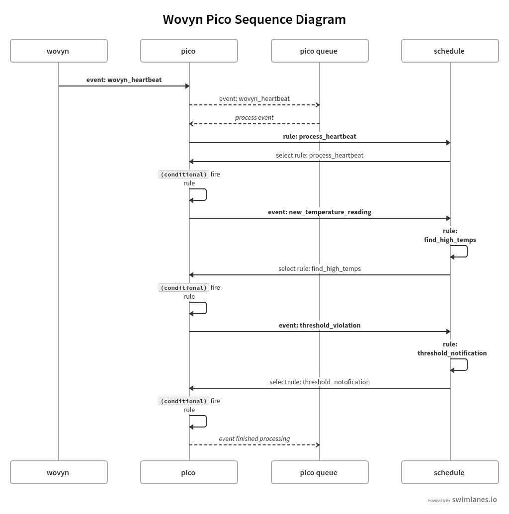

# Allison Bellows </br> Lab 3 Answers

### Ruleset URLs

[wovyn_base](https://raw.githubusercontent.com/albellows/reimagined-guacamole/master/lab3/wovyn_base.krl) 

[twilio](https://raw.githubusercontent.com/albellows/reimagined-guacamole/master/lab3/twilio.krl)

---

### #1

I used a pre-commit hook for git and commited changes whenever I made significant edits.

### #2

I used an event expression.  The advantages include succinct and unambiguous syntax, plus the ability to be translated into a program (which can programatically recognize patterns) by event processors.  The disadvantages against a rule conditional include a learning curve for unusual syntax and potential lack of scalability.

### #3

Before adding find_high_temps, output looked like this:

```krl
[EPISODE_START] cjrud78lt004k2zw7go3b08sk event/5vuhyTK9LZNBXcR6t5nMJA/42/wovyn/heartbeat
[DEBUG] cjrud78lt004k2zw7go3b08sk | event received: wovyn/heartbeat attributes {"version":2,"eventDomain":"wovyn.emitter","eventName":"sensorHeartbeat","emitterGUID":"DC4F22163ECD","genericThing":{"typeId":"2.1.2","typeName":"generic.simple.temperature","healthPercent":78.89,"heartbeatSeconds":20,"d...
[DEBUG] cjrud78lt004k2zw7go3b08sk | event added to pico queue: cjru4zz2z00072fw7tcmu2gwo
[DEBUG] cjrud78lt004k2zw7go3b08sk | event being processed
[DEBUG] cjrud78lt004k2zw7go3b08sk | rule added to schedule: wovyn_base -> process_heartbeat
[DEBUG] cjrud78lt004k2zw7go3b08sk | rule selected: wovyn_base -> process_heartbeat
[DEBUG] cjrud78lt004k2zw7go3b08sk | fired
[DEBUG] cjrud78lt004k2zw7go3b08sk | event finished processing
[DEBUG] cjrud78lt004k2zw7go3b08sk | {"directives":[{"options":{},"name":"say","meta":{"rid":"wovyn_base","rule_name":"process_heartbeat","txn_id":"cjrud78lt004k2zw7go3b08sk","eid":"42"}}]}
[EPISODE_STOP] cjrud78lt004k2zw7go3b08sk
```

Directives were returned every 20 seconds, which was the duration of my heartbeat. Assuming "how many rules ran" = "how many rules fired", I think the process_heartbeat rule ran every time (so the number of rules that ran is t/20, where t is the timespan in seconds where I tested without find_high_temps).  Estimate t = 300 --> rulesran = 15.  This is because the genericThing attribute was never null when I called this rule.


### #4

After adding find_high_temps, output looked like this:

```krl
[EPISODE_START] cjrude477004z2zw7ealn0hr4 event/5vuhyTK9LZNBXcR6t5nMJA/42/wovyn/heartbeat
[DEBUG] cjrude477004z2zw7ealn0hr4 | event received: wovyn/heartbeat attributes {"version":2,"eventDomain":"wovyn.emitter","eventName":"sensorHeartbeat","emitterGUID":"DC4F22163ECD","genericThing":{"typeId":"2.1.2","typeName":"generic.simple.temperature","healthPercent":78.89,"heartbeatSeconds":20,"d...
[DEBUG] cjrude477004z2zw7ealn0hr4 | event added to pico queue: cjru4zz2z00072fw7tcmu2gwo
[DEBUG] cjrude477004z2zw7ealn0hr4 | event being processed
[DEBUG] cjrude477004z2zw7ealn0hr4 | rule added to schedule: wovyn_base -> process_heartbeat
[DEBUG] cjrude477004z2zw7ealn0hr4 | rule selected: wovyn_base -> process_heartbeat
[DEBUG] cjrude477004z2zw7ealn0hr4 | fired
[DEBUG] cjrude477004z2zw7ealn0hr4 | adding raised event to schedule: wovyn/new_temperature_reading attributes {"temperature":[{"name":"enclosure temperature","transducerGUID":"28B8AE230A0000BB","units":"degrees","temperatureF":73.85,"temperatureC":23.25}],"timestamp":"2019-02-07T08:38:39.816Z"}
[DEBUG] cjrude477004z2zw7ealn0hr4 | rule added to schedule: wovyn_base -> find_high_temps
[DEBUG] cjrude477004z2zw7ealn0hr4 | rule selected: wovyn_base -> find_high_temps
[DEBUG] cjrude477004z2zw7ealn0hr4 | not fired
[DEBUG] cjrude477004z2zw7ealn0hr4 | event finished processing
[DEBUG] cjrude477004z2zw7ealn0hr4 | {"directives":[{"options":{},"name":"say","meta":{"rid":"wovyn_base","rule_name":"process_heartbeat","txn_id":"cjrude477004z2zw7ealn0hr4","eid":"42"}}]}
[EPISODE_STOP] cjrude477004z2zw7ealn0hr4
```

Where the find_high_temps events logged as "not fired" if the temperature in Fahrenheit was >= temperature_threshold (was 75, then 70), or "fired" otherwise.  Directives were returned every 20 seconds.  I think the process_heartbeat rule ran every time, as above, and the find_high_temps and threshold_notification rules ran a couple times (when I modified the global threshold to be lower).  So the number of rules that ran is t/20 + 3l/20, where t is the timespan in seconds where I tested with find_high_temps and a higher threshold and l is the timespan in seconds where I tested with find_high_temps and a lower threshold.  Estimate t = 300 and l = 200 --> rulesran = 45.

### #5

This difference is accounted for by the fact that several rules (the ones we implemented after adding find_high_temps) require being raised _by another rule_.  You'll see in the diagram that find_high_temps and threshold_notification are raised to the schedule not by an event sent from an external source to the pico (like wovyn_heartbeat), but instead by events raised by other rules firing.  Without the find_high_temps rule being added to the schedule, no other rules than process_heartbeat in this event space would be fired.




### #6

Yes, it is an event stream splitting intermediary.  It uses an event parameter (temperature) from the new_temperature_reading event  to split the event stream and send in different directions.  That is, it raises the event threshold_violation in one stream, and doesn't raise any more events in the other.

### #7

Here are some example lines from the logs that show find_high_temps works.  The below logs are output when new_temperature_reading is raised to the schedule and the temperature threshold has been set low (65).  The first line of the logs shows temperature reading was 71.6, which is greater than the threshold of 65 (line 4), so find_high_temps fired (line 5).  By firing, it raised the threshold_violation event to the schedule, which selected and fired the threshold_notification rule (lines 6-10).

```krl
[DEBUG] cjrvbox0l004cjuw724fdiwa9 | adding raised event to schedule: wovyn/new_temperature_reading attributes {"temperature":[{"name":"enclosure temperature","transducerGUID":"28B8AE230A0000BB","units":"degrees","temperatureF":72.84,"temperatureC":22.69}],"timestamp":"2019-02-08T00:38:50.668Z"}
[DEBUG] cjrvbox0l004cjuw724fdiwa9 | rule added to schedule: wovyn_base -> find_high_temps
[DEBUG] cjrvbox0l004cjuw724fdiwa9 | rule selected: wovyn_base -> find_high_temps
[KLOG] cjrvbox0l004cjuw724fdiwa9 | threshold:  65
[DEBUG] cjrvbox0l004cjuw724fdiwa9 | fired
[DEBUG] cjrvbox0l004cjuw724fdiwa9 | adding raised event to schedule: wovyn/threshold_violation attributes {"temperature":[{"name":"enclosure temperature","transducerGUID":"28B8AE230A0000BB","units":"degrees","temperatureF":72.84,"temperatureC":22.69}],"timestamp":"2019-02-08T00:38:50.668Z"}
[DEBUG] cjrvbox0l004cjuw724fdiwa9 | rule added to schedule: wovyn_base -> threshold_notification
[DEBUG] cjrvbox0l004cjuw724fdiwa9 | rule selected: wovyn_base -> threshold_notification
[DEBUG] cjrvbox0l004cjuw724fdiwa9 | fired
[DEBUG] cjrvbox0l004cjuw724fdiwa9 | event finished processing
```

The below logs show the same portion of the event cycle but when the temperature threshold is set higher (75).  The first line of the logs shows the temperature reading was 73.5, which was less than the higher threshold of 75 (line 4), so find_high_temps did not fire (line 5), and the event finished processing (line 6).

```krl
[DEBUG] cjrvbofps004bjuw7stek51vs | adding raised event to schedule: wovyn/new_temperature_reading attributes {"temperature":[{"name":"enclosure temperature","transducerGUID":"28B8AE230A0000BB","units":"degrees","temperatureF":72.84,"temperatureC":22.69}],"timestamp":"2019-02-08T00:38:28.247Z"}
[DEBUG] cjrvbofps004bjuw7stek51vs | rule added to schedule: wovyn_base -> find_high_temps
[DEBUG] cjrvbofps004bjuw7stek51vs | rule selected: wovyn_base -> find_high_temps
[KLOG] cjrvbofps004bjuw7stek51vs | threshold:  75
[DEBUG] cjrvbofps004bjuw7stek51vs | not fired
[DEBUG] cjrvbofps004bjuw7stek51vs | event finished processing
```

These examples show the rule works because it only fires when the temperature reading exceeds the threshold, and when it fires, it raises the threshold_violation event to the schedule, which selects and fires the threshold_notification rule, which texts me "High temperature!".  This is the expected behavior.