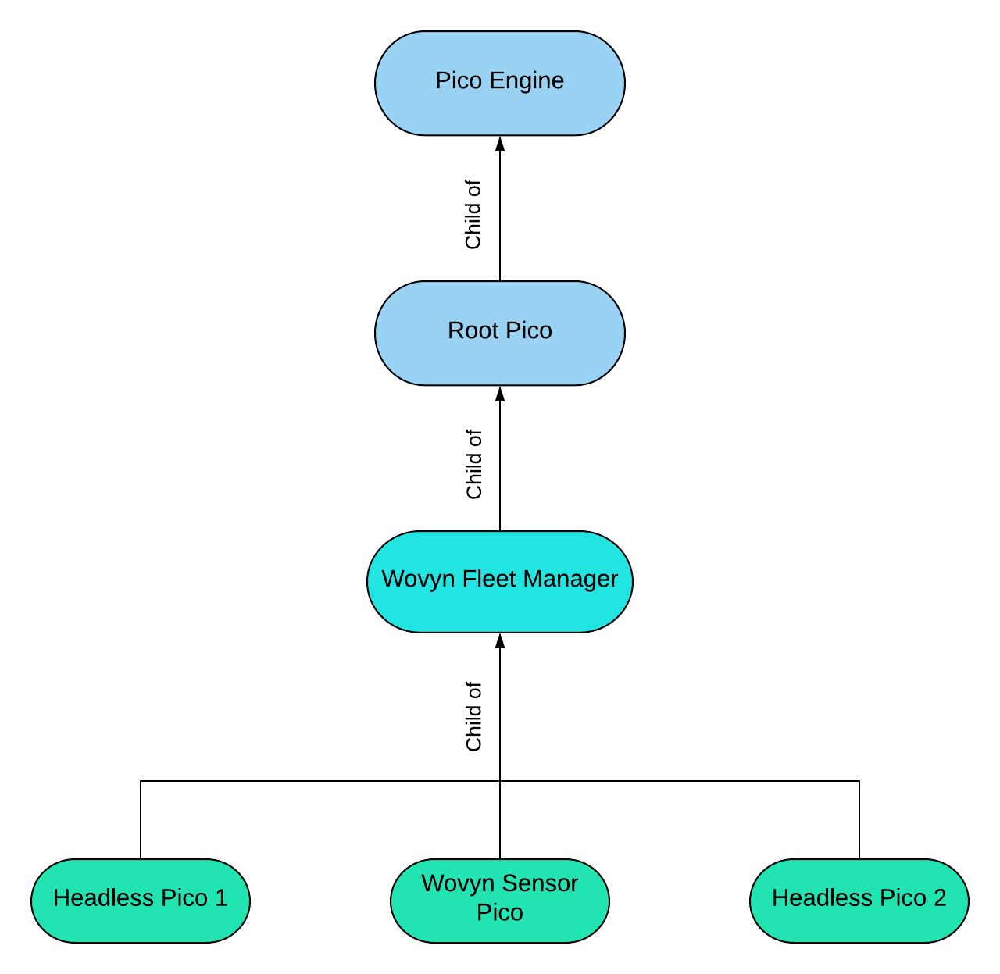

# Allison Bellows Lab 6 Answers

## URLs

> **New**  
>[manage_sensors](https://raw.githubusercontent.com/albellows/reimagined-guacamole/master/lab6/manage_sensors.krl)

> **Old**  
>[sensor_profile](https://raw.githubusercontent.com/albellows/reimagined-guacamole/master/lab6/sensor_profile.krl)  
[temperature_store](https://raw.githubusercontent.com/albellows/reimagined-guacamole/master/lab6/temperature_store.krl) 
[wovyn_base](https://raw.githubusercontent.com/albellows/reimagined-guacamole/master/lab6/wovyn_base.krl)

## Pico Relationship Diagram

The above diagram uses three example sensor picos, continuing the example in my test driver.  But the bottom level of green picos can be conceptually replaced with any number of sensor picos created programmatically by the `manage_sensors` ruleset.

---

## Answers to Questions

### #1

I use the wrangler `child_creation` event to install rules in the new child pico.  This event is run as I'm initially creating the child pico, and as part of the event I supply the rids of the rules I want to install.

### #2

I use two rules - I tell the pico that its profile was updated in `ready_sensor_pico` , which is *separate* from my `create_sensor_pico` rule.  The former is only raised by the Wrangler `child_initialized` event, which is raised if and only if that pico exists.

### #3

I wrote a nifty bash script that uses the `sky/event` API to send `sensor/new_sensor` events to my manager pico - thus creating new sensor picos. It then uses that same event API as well as the `sky/cloud` API to send some heckin' good events and queries, such as checking/updating sensor profiles and temperature stores.

### #4

Although this doesn't seem ideal, I could simply expose certain functions between the sensor picos with the `provides` method.  (I have an inkling a more ideal way would be with pico subscriptions, but I will probably have better inklings about that after the next lab)