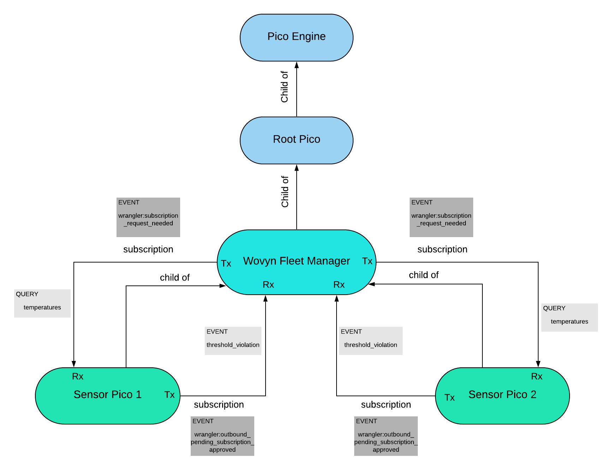

# Allison Bellows  Lab 7 Answers

## URLs

> **New/Modified**  
> [manage_sensors](https://raw.githubusercontent.com/albellows/reimagined-guacamole/master/lab7/manage_sensors.krl)  
> [manager_profile](https://raw.githubusercontent.com/albellows/reimagined-guacamole/master/lab7/manager_profile.krl)  
> [auto_accept](https://raw.githubusercontent.com/albellows/reimagined-guacamole/master/lab7/auto_accept.krl)  
> [wovyn_base](https://raw.githubusercontent.com/albellows/reimagined-guacamole/master/lab7/wovyn_base.krl)

> **Old**  
> [temperature_store](https://raw.githubusercontent.com/albellows/reimagined-guacamole/master/lab7/temperature_store.krl)  
> [sensor_profile](https://raw.githubusercontent.com/albellows/reimagined-guacamole/master/lab7/sensor_profile.krl)

## Pico Relationship Diagram

This diagram shows two example sensor picos, as in the instance of connecting both my and a classmate's Wovyn sensors to a manager pico via subscription.  (This is a tad visually redundant because both are treated the same by the manager pico, but I figured I would demonstrate understanding of the actual setup introduced by the lab steps).  

Events in dark gray boxes show events sent between picos after an initial `wrangler/subscription` event has been raised.  These are part of the [inner workings of the subscription ruleset](https://picolabs.atlassian.net/wiki/spaces/docs/pages/186843209/Managing+Subscriptions).  Once a loop around the directional arrows has been made with the shown dark gray events, the subscriptions have been established as shown.  At this point, the events/queries in the light gray boxes (which show explicit events/queries I was sending in this lab) can be successfully sent along those same directional arrows.

---

## Answers to Questions

### #1

Auto-approval rules for subscriptions are insecure because if a pico accepts all subscription requests, anyone with access to that pico's ECI can control it with their own picos.  In fact, not only can they access that pico's rulesets, but they can install and use their own rulesets.  This is obviously insecure because bad actors can use an auto-accept pico for all kinds of uses beyond its intended purposes, including accessing private data.

### #2

Yes.  You can take another pico with the `manage_sensors` ruleset isntalled and use that ruleset to introduce it to the sensor pico via a new (unique) subscription with a managing Rx_role (I call this role "controller").  Then the sensor pico will have multiple subscriptions whose Tx_roles are "controller" and Rx_roles are "sensor".  There is nothing in the current code preventing this.

### #3

I could still use one sensor controller pico, but it could have many subscriptions with subscription roles that specify the sensor type.  E.g. Some Tx_roles are "temperature_sensor", others are "humidity_sensor", and so on.  Or better, given a large amount of sensors, sensor types, and/or unique functionality per sensor type, I would consider having a sensor controller pico for each sensor type and a fleet controller pico that controls all those controller picos (3 layers total).  Under that model, it would be the subscription roles between the sensor controllers and the fleet controller that most crucially specify the sensor type.

### #4

As in #3, I could use subscription roles or multiple layers of controllers.  Because the functionality for picos on different floors is likely to be nearly the same, I would default to the former.  If I knew there would be just one sensor per room, for example, I *could* use subscription names instead of roles, but this would be less scalable.  

With this method, I would have a sensor controller pico with subscriptions to all picos in the building; its subscription Tx_roles would specify the sensor location in some subsettable way.  (e.g. its subscription to a sensor in room 120 might have a Tx_role "sensor_120").  Then the controller could query specific floors or areas by filtering its subscriptions on Tx_role just as easily as it could query the whole building.  (e.g. a temperature-query function could take in an array of location numbers and loop through that array, each *ith* iteration sending a sky query to all subscriptions with Tx_role "sensor_*i* ", thus building the data structure of overall temperatures to return.  To query temperature info from the first floor, one could call this function with the array [100-199]).

### #5

Yes!  The beauty of heterarchy.  In *my* rule handling the `wovyn/threshold_violation` event, I used a `foreach` statement that filters the sensor picos' subscriptions for Tx_roles of "controller", and loops over these subscriptions sending `manager/threshold_violation` events to each.  Manager picos use the `twilio:sms` function and stored manager profile info to send a text alert about the violation.  Therefore, in my system, if a sensor belongs to more than one collection and has a threshold violation, all of its managing picos will receive a `manager/threshold_violation` event and send a text alert.

Of course, the lab spec did say singular "sensor management pico" in step 6.  My guess was that this was unintentional, if not vague.  But if I wanted to enforce that a sensor pico only notifies the manager of *one* collection, I could replace my `foreach` implementation with a single event-raising by using `.first()` on the pico's Tx-filtered subscriptions.

### #6

